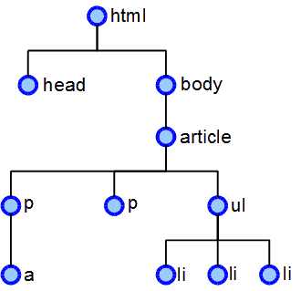
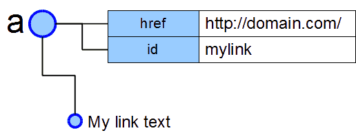

# Document Object Model (DOM)
Consider this HTML document:


```html
<html>
  <head></head>
  <body>
    <article>
      <p class="intro"><a href="#">a link</a></p>
      <p>another paragraph</p>
      <ul id="list">
        <li>item 1</li>
        <li>item 2</li>
        <li>item 3</li>
      </ul>
    </article>
  </body>
</html>
```

Within a browser, the document is represented by a tree data structure.



* The HTML tag is the root element.
* Each element is known as a node and it has children sprouting from it.
* A node can have any number of child nodes.
* A node can only have one parent - with the exception of the HTML node which doesn't have any.
* If we look at an individual node, say the unordered list, we can access it's parent - the article - and work our way up the tree to the grandparent, the great grandparent etc.
* We can also access it's siblings - these are nodes with the same parent, i,e. the two paragraph tags
* finally, we can access it's children - that is nodes which have the `ul` as a parent in this case, all the list elements.

We can examine individual nodes, such as the anchor link:



* it has a couple of attributes (as well as default ones)
* it also has the text value which is another child node

Even whitespace in an HTML document is stored in the DOM tree. This can be confusing at first, e.g. the `ul` tag could have seven child nodes rather than three because each `li` has whitespace around it.


## Accessing the DOM
Access to the current page's DOM is via the `document` object (a global property of the `window` object).

https://developer.mozilla.org/en-US/docs/Web/API/Document

### DOM retrival methods
To retrieve nodes from the DOM, use:

* `document.getElementById(id)` - returns an [Element](https://developer.mozilla.org/en-US/docs/Web/API/Element) or null
* `document.getElementsByClassName(class)` - returns a live [HTMLCollection](https://developer.mozilla.org/en-US/docs/Web/API/HTMLCollection)
* `document.getElementsByName(name)` (typically a form field with `name="something"`) - returns a live [NodeList](https://developer.mozilla.org/en-US/docs/Web/API/NodeList)
* `document.getElementsByTagName(tag)` - returns a live [HTMLCollection](https://developer.mozilla.org/en-US/docs/Web/API/HTMLCollection)
* `document.querySelector(css)` (the first matching CSS element) - returns an [Element](https://developer.mozilla.org/en-US/docs/Web/API/Element) or null
* `document.querySelectorAll(css)` (all matching CSS elements) - returns a live [NodeList](https://developer.mozilla.org/en-US/docs/Web/API/NodeList)

Selecting by ID or class will be faster than CSS selector.

HTMLCollection and NodeList are array-like lists of Element objects. *Live* lists update automatically when a matching element is added or removed from the DOM.

**Note**: although collections are array-like and have a `.length`, they're not arrays and you cannot use array methods such as `sort()`. ES6 allows quick conversion to an array using `Array.from()`.


### Element retrival methods
Once you have an [Element](https://developer.mozilla.org/en-US/docs/Web/API/Element), the following properties and methods can be used to return further elements including:

* `.getElementsByClassName(class)`
* `.getElementsByName(name)`
* `.getElementsByTagName(tag)`
* `.querySelector(css)`
* `.querySelectorAll(css)`
* `.children` - returns a live [HTMLCollection](https://developer.mozilla.org/en-US/docs/Web/API/HTMLCollection)
* `.firstElementChild`
* `.lastElementChild`
* `.previousElementSibling`
* `.nextElementSibling`


It also supports [Node](https://developer.mozilla.org/en-US/docs/Web/API/Node) properties and methods, but be wary these may return whitespace nodes:

* `childNodes`
* `firstChild`
* `lastChild`
* `nextSibling`
* `parentNode`
* `textContent`
* `appendChild()`
* `insertBefore()`
* `cloneNode()`
* `removeChild()`
* `replaceChild()`
* `textContent`

**Tip**: view all properties and methods of an element in the developer console. Chrome: Properties tab, Firefox: right-click node, choose **DOM Properties**.


### Exercises
Using the HTML above (or similar)...

1. Get the element with the ID 'list'.
1. Get the element with the class 'intro'.
1. Find any paragraph without the class 'intro'.
1. Count the number of child elements of the first element with the class 'intro'.
1. Find the last paragraph.
1. Find the last list item.
1. Remove the last paragraph.
1. Move the the first paragraph to the end of the article.

You shouldn't require any JavaScript functions or loops!

Finally, travel the whole DOM tree and output the name of every element node (use recursion!)
